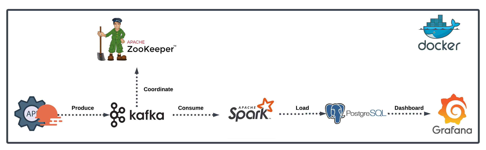

# Real-Time Data Streaming: Jabodetabek
This project aims to analyze various events using data sourced from the OpenWeather API. The analysis focuses on real-time information related to weather conditions for specific locations. In its development, the project employs streaming processing methods, where the incoming data is retrieved from the OpenWeather API to simulate real-time updates and events.

## About the Data
The OpenWeather API is a weather data service that provides real-time and forecasted weather information for various locations worldwide. It offers access to a wide range of weather data, including temperature, humidity, wind speed, and more. Developers can integrate the OpenWeather API into their applications to retrieve up-to-date weather details, enabling them to enhance user experiences, build weather-related features, and make informed decisions based on weather conditions. To use the OpenWeather API, you need an API key, which is obtained by signing up on the OpenWeather website.

## Architecture


## Tools
### Kafka
Apache Kafka is a streaming data processing system that can be used to build real-time data architectures. In this project, Kafka serves as middleware to transmit weather data obtained from the OpenWeather API to the next data processing system (Pyspark).

### Pyspark
Pyspark is part of the Apache Spark ecosystem, providing a Python API for distributed data processing. In this project, Pyspark is used to fetch, process, and analyze real-time weather data received from Kafka.

### Neon with PostgreSQL
Neon is a platform for managing streaming data integrated with PostgreSQL. In this project, Neon is used to store the analyzed weather data processed by Pyspark into a PostgreSQL database.

### Grafana
Grafana is a data visualization platform that enables the creation of interactive dashboards and graphs. In this project, Grafana is used to present intuitively and informatively the weather data processed by Pyspark.

## Getting Started
### Prerequisites
- [Chocolatey](https://chocolatey.org/install)
- [Docker Desktop](https://www.docker.com/products/docker-desktop/)

### Configuration
1. Create your Open Weather API account to get API key.
2. Create postgres database at [neon](https://neon.tech/).
3. Configure the API key and database connection values in environment file (.env).

### Setup

1. **Clone This Repo:**
   ```bash
   git clone https://github.com/JoseBenaya/jabodetabek-weather-realtime-streaming.git
   ```

2. Build Docker Images:

   For x86 architecture:
   ```bash
   make docker-build
   ```

   For ARM architecture:
   ```bash
   make docker-build-arm
   ```

3. Run Kafka:
   ```bash
   make kafka
   ```

4. Run Spark:
   ```bash
   make spark
   ```

5. Run Producer:
   ```bash
   make spark-produce
   ```

6. Run Consumer:
   ```bash
   make spark-consume
   ```

5. Run Grafana:
   ```
   make grafana-dash
   ```

6. Wait until all containers are ready.

7. Access Grafana on your browser: http://localhost:3030/

8. Login Grafana with:
   - **Username:** admin
   - **Password:** grafana

9. Configure the connection to the database according to the Neon database you have.

10. Import **dashboard.json** from grafana folder